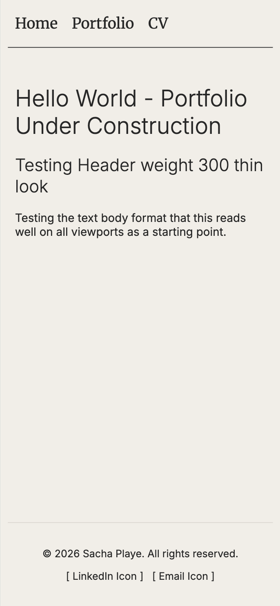
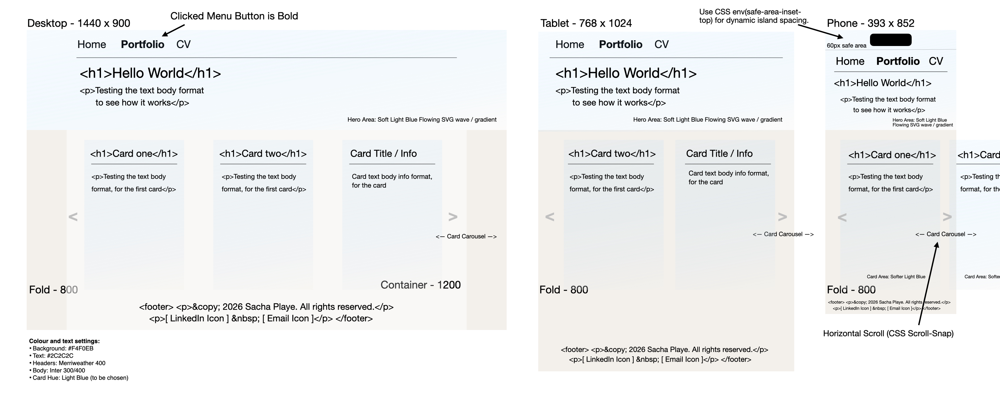
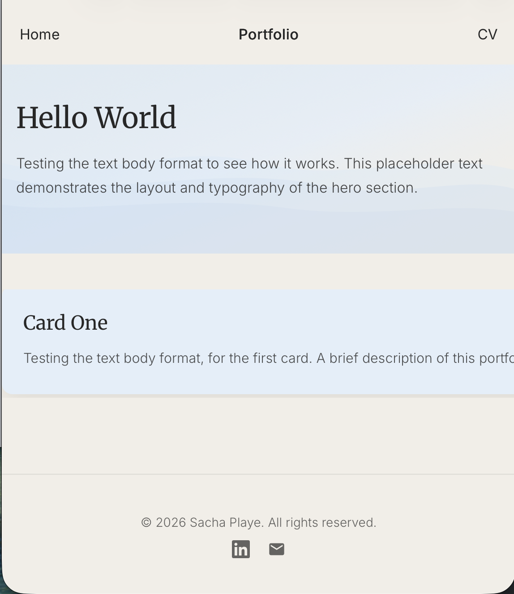
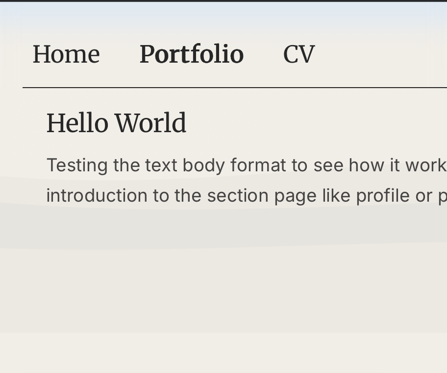
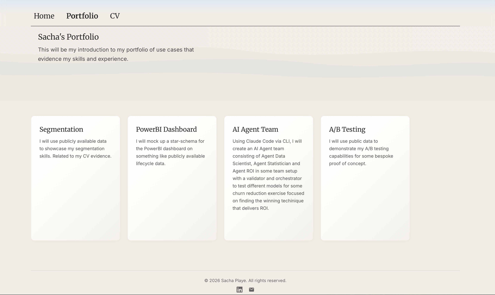
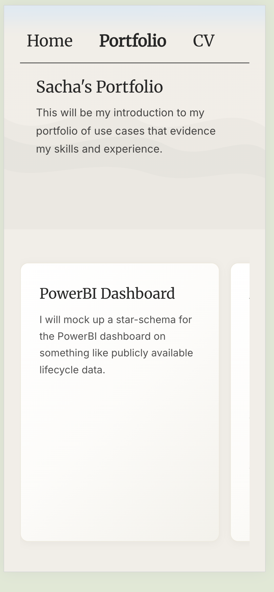

---

tags: [human, Sacha, landing, structured, design, Sprint_1]

created: 2026-04-12

tag_id: 15

---
> LOG - GitHub_Pages/CU-869cvtx7e-Create_Site-brch
> Documentation for github.io Live Pages design
---
---
# Abstract

Below is the documentation supporting the build of my professional portfolio using html and css. It includes my summary (home), portfolio and CV page. The focus is on the Portfolio page since this is the most complex page to build. I also include 4 card placeholders for the following use cases:
- **Segmentation:**  A Manual Segmentation & Lifecycle Modelling example.
- **BI Dashboard:**  Demonstration of my dashboard skills using Power BI
- **AI Agent Team:**  Creating an AI Agent team to work on an ROI example.
- **A/B Testing:**  Provide an example POC to showcase A/B testing skills.
I used ClickUp sprints and Kanban for working agile and Git for version control.

- **Change history is viewable on the following path:**
	https://github.com/sachaplaye/sachaplaye.github.io/deployments


# Documentation 
---
---
## Contents

1. 2026 Standard Viewport sizes: We check out the [2026 Standards](#2026-standards)
2. Boilerplate Manual MockUp: I work to these [Mockup Sizes](#mockup-sizes)
3. Sketch out a Storyboard: [Story board](#story-board) 
4. Prompt Claude Opus: [The Prompt](#the-prompt)
	- & View Start Draft: [The Results](#the-results) and [The Html](#the-html)
5. Manual edits to clean up: [The Manual Edits](#manual-edits)
6. Final adjustments to prior adding use cases and CV: [The Final Adjustments](#final-adjustments)


---
---
## Method

### 2026-Standards
**First I look at view port sizes for storyboard MockUp**
2026 Viewport Dimensions (Width x Height)

| **Device Category**    | **Design Size (W x H)** | **Common Aspect Ratio**          |
| ---------------------- | ----------------------- | -------------------------------- |
| **Smartphone**         | 393 x 852 px            | 19.5:9 (Modern iPhones/Androids) |
| **Tablet (Portrait)**  | 768 x 1024 px           | 4:3 (Classic iPad Baseline)      |
| **Tablet (Landscape)** | 1024 x 768 px           | 4:3                              |
| **Desktop (Standard)** | 1440 x 900 px           | 16:10 (Modern Laptops/MacBooks)  |
| **Desktop (Full HD)**  | 1920 x 1080 px          | 16:9 (Standard Monitors)         |
| **Ultrawide**          | 2560 x 1440 px          | 16:9 (QHD Displays)              |


---
---
## Mockup-Sizes

- **Mobile:** 393 x 852 px
- **Tablet:** 768 x 1024 px
- **Desktop:** **1920 x 1080 px** with container = 1440 x 900 px or 1200px ..
 
**My BoilerPlate manual code is below:**


- Here I am going for minimalist view


---
---
## Story-board
- I will use Claude Visual + Artifact to draft the first html/css
- I designed this using Keynote.
- I can tweak the design afterwards.


- One thing to note I put a swish light blue gradient left-right in top 3rd, I may drop this later.
	- It depends if I can find some nice barely visible landscape or hue since the boiler plate I created, (less is more)


---
---
## The-Prompt
### I use for Claude Opus:
---
**Prompt:**
> Act as an expert Front-End Web Developer. I have attached a storyboard showing three responsive viewports (Desktop, Tablet, and Mobile Phone) for my portfolio website. 
> 
> Please generate a single, clean HTML file with embedded CSS (`<style>`) to build this first draft. Use Claude's Artifacts feature to render it.
> 
> **Global Styles & Design System:**
> *   **Background:** `#F4F0EB`
> *   **Text:** `#2C2C2C`
> *   **Headers:** Use 'Merriweather' (weight 400) imported from Google Fonts.
> *   **Body text:** Use 'Inter' (weights 300 and 400) imported from Google Fonts. 
> *   Ensure the whole page uses a Flexbox column layout with `min-height: 100vh` so the footer is always pushed to the bottom.
> 
> **1. The Header (Crucial Layout):**
> *   Make the `<header>` a flex container using `display: flex; justify-content: space-between; align-items: center;`. This will ensure "Home" (or my name) is pinned to the left, "CV" is pinned to the right, and "Portfolio" (which should be bolded as the active state) is perfectly centered. Note these will be button hyperlinks to other pages.
> *   **Mobile specific:** Include `padding-top: max(20px, env(safe-area-inset-top));` to ensure the header avoids the iPhone Dynamic Island.
> 
> **2. The Hero Section:**
> *   Create a top-third hero area that features a soft, light blue, flowing SVG wave or soft gradient background.
> *   Place the `<h1>Hello World</h1>` and the `<p>` testing text below or layered elegantly over the bottom edge of this soft blue area.
> 
> **3. The Portfolio Cards (Responsive Carousel):**
> *   Create a container for the cards. The cards themselves should have a very soft, light blue background (`#E6F0F9` or similar) to match the hero theme. There will be 4 cards (for 4 topics)
> *   **Desktop/Tablet:** Display the cards in a standard Flexbox or CSS Grid layout.
> *   **Mobile:** As shown in the storyboard, convert this container into a horizontal slider. Use `display: flex`, `overflow-x: auto`, and **CSS Scroll-Snap** (`scroll-snap-type: x mandatory`). Size the cards on mobile (e.g., `width: 85%`) so that the second card is visually cut off by the edge of the screen, hinting to the user that they can scroll.
> 
> **4. The Footer:**
> *   Simple, centered text aligning with the annotations in the mockup, keeping the copyright and social placeholders stacked. 
> 
> Please write clean, semantic HTML5, well-commented CSS, and ensure the responsive transitions happen cleanly at standard breakpoints (e.g., 768px for tablet, 1200px for desktop).


---
---
## The-Results
- Half my original work got unmade by Claude.
- Half of the things I asked for got added.
- Also, I notice it bundled the style sheet into the html page.
- <mark>It's a good starting point.</mark>

***screenshot of the output:***


**We can straight off see the differences between my Storyboard and the above.**
- I will just manually edit the differences myself.

**My decision is going to be on two versions:**
- To have the blue sky flush at the top and a blue card below
- Drop the blue sky as the menu was originally looking sleek and just add the white/blue cards
- Also it won't be blue it will be paper look with an ever so hint of blue to lift it off the page.

#### The Commentary from Claude on the build:
---
**Here's the plan for your portfolio site based on the storyboard:**

**Layout & Design System:** Full-page flexbox column with `#F4F0EB` background, Merriweather headers, Inter body text, footer pushed to bottom via `min-height: 100vh`.

**Header:** Three navigation items ("Home", "Portfolio" bold/active, "CV") using `justify-content: space-between` for pinned-left/center/right alignment. Mobile gets `env(safe-area-inset-top)` padding for Dynamic Island.

**Hero Section:** Soft light-blue flowing SVG wave background filling the top portion, with the H1 and intro paragraph positioned over the lower edge.

**Portfolio Cards (×4):** Light blue (`~#E6F0F9`) cards in a CSS Grid on desktop/tablet (2–3 columns). On mobile, switches to a horizontal scroll-snap carousel where cards are `~85%` width so the next card peeks in from the right.

**Footer:** Centered copyright line + LinkedIn/Email icon placeholders, pushed to the bottom.

**Breakpoints:** 768px (tablet) and 1200px (desktop).

Ready to build it — let me go ahead. Here's your first draft! Here's a quick rundown of what's in place:

**What's working:**

- **Header** — three nav links spaced with `justify-content: space-between`; "Portfolio" is bold as the active state. Sticky on scroll, with `env(safe-area-inset-top)` padding for iPhone notch/Dynamic Island.
- **Hero** — layered SVG waves in soft light blue (#D6EAF8 → #E6F0F9) with the H1 and body text positioned over the lower portion.
- **Cards (×4)** — 3-column grid on desktop, 2-column on tablet (≤1024px), and a horizontal scroll-snap carousel on mobile (≤768px) where cards are 85% width so the next one peeks in.
- **Footer** — copyright + LinkedIn/email SVG icons, pushed to the bottom via flexbox.
- **Fonts** — Merriweather for headings, Inter 300/400 for body, all imported from Google Fonts.

**Things you might want to tweak next:**

- Actual card content and link destinations
- Wave shape/intensity — I can make it more or less dramatic
- Card hover effects or click-through behaviour
- Any animation or scroll transitions


---
---
## The-Html:

```html
<!DOCTYPE html>
<html lang="en">
<head>
<meta charset="UTF-8">
<meta name="viewport" content="width=device-width, initial-scale=1.0">
<title>Sacha Playe — Portfolio</title>

<!-- Google Fonts -->
<link rel="preconnect" href="https://fonts.googleapis.com">
<link rel="preconnect" href="https://fonts.gstatic.com" crossorigin>
<link href="https://fonts.googleapis.com/css2?family=Inter:wght@300;400&family=Merriweather&display=swap" rel="stylesheet">

<style>
/* ============================================
   RESET & GLOBAL STYLES
   ============================================ */
*, *::before, *::after {
  margin: 0;
  padding: 0;
  box-sizing: border-box;
}

html {
  scroll-behavior: smooth;
}

body {
  font-family: 'Inter', sans-serif;
  font-weight: 300;
  color: #2C2C2C;
  background-color: #F4F0EB;
  min-height: 100vh;
  display: flex;
  flex-direction: column;
  -webkit-font-smoothing: antialiased;
}

h1, h2, h3 {
  font-family: 'Merriweather', serif;
  font-weight: 400;
}

/* ============================================
   CONTAINER — max 1200px centered
   ============================================ */
.container {
  width: 100%;
  max-width: 1200px;
  margin: 0 auto;
  padding: 0 24px;
}

/* ============================================
   1. HEADER / NAVIGATION
   ============================================ */
header {
  position: sticky;
  top: 0;
  z-index: 100;
  background-color: #F4F0EB;
  /* Mobile: respect Dynamic Island / notch */
  padding-top: max(20px, env(safe-area-inset-top));
  padding-bottom: 16px;
}

nav {
  display: flex;
  justify-content: space-between;
  align-items: center;
  max-width: 1200px;
  margin: 0 auto;
  padding: 0 24px;
}

nav a {
  text-decoration: none;
  color: #2C2C2C;
  font-family: 'Inter', sans-serif;
  font-weight: 400;
  font-size: 1rem;
  padding: 8px 4px;
  transition: opacity 0.2s ease;
}

nav a:hover {
  opacity: 0.6;
}

/* Active page link is bold */
nav a.active {
  font-weight: 700;
}

/* ============================================
   2. HERO SECTION
   ============================================ */
.hero {
  position: relative;
  overflow: hidden;
  padding: 60px 0 80px;
}

/* Soft light-blue flowing SVG wave background */
.hero-bg {
  position: absolute;
  top: 0;
  left: 0;
  width: 100%;
  height: 100%;
  z-index: 0;
}

.hero-bg svg {
  position: absolute;
  top: 0;
  left: 0;
  width: 100%;
  height: 100%;
}

.hero-content {
  position: relative;
  z-index: 1;
  max-width: 1200px;
  margin: 0 auto;
  padding: 0 24px;
}

.hero-content h1 {
  font-size: clamp(2rem, 5vw, 3.2rem);
  margin-bottom: 16px;
  line-height: 1.3;
}

.hero-content p {
  font-size: clamp(1rem, 2vw, 1.15rem);
  line-height: 1.7;
  max-width: 540px;
  opacity: 0.85;
}

/* ============================================
   3. PORTFOLIO CARDS SECTION
   ============================================ */
.portfolio {
  flex: 1; /* Push footer down */
  padding: 40px 0 60px;
}

.portfolio-heading {
  max-width: 1200px;
  margin: 0 auto 24px;
  padding: 0 24px;
}

/* --- Card Grid (Desktop / Tablet default) --- */
.card-carousel {
  display: grid;
  grid-template-columns: repeat(3, 1fr);
  gap: 24px;
  max-width: 1200px;
  margin: 0 auto;
  padding: 0 24px;
}

.card {
  background-color: #E6F0F9;
  border-radius: 12px;
  padding: 32px 28px;
  display: flex;
  flex-direction: column;
  gap: 12px;
  transition: transform 0.25s ease, box-shadow 0.25s ease;
  cursor: pointer;
}

.card:hover {
  transform: translateY(-4px);
  box-shadow: 0 8px 24px rgba(0, 0, 0, 0.08);
}

.card h2 {
  font-size: 1.35rem;
  line-height: 1.3;
}

.card p {
  font-size: 0.95rem;
  line-height: 1.65;
  opacity: 0.8;
}

/* ============================================
   4. FOOTER
   ============================================ */
footer {
  text-align: center;
  padding: 40px 24px;
  border-top: 1px solid rgba(44, 44, 44, 0.1);
  margin-top: auto;
}

footer p {
  font-size: 0.875rem;
  line-height: 1.8;
  opacity: 0.7;
}

footer .social-links {
  margin-top: 8px;
  display: flex;
  justify-content: center;
  gap: 20px;
}

footer .social-links a {
  color: #2C2C2C;
  text-decoration: none;
  font-size: 0.875rem;
  font-weight: 400;
  opacity: 0.7;
  transition: opacity 0.2s ease;
}

footer .social-links a:hover {
  opacity: 1;
}

/* LinkedIn & Email simple SVG icons */
footer .social-links a svg {
  width: 20px;
  height: 20px;
  vertical-align: middle;
  fill: #2C2C2C;
}

/* ============================================
   RESPONSIVE — Tablet (≤ 1024px)
   ============================================ */
@media (max-width: 1024px) {
  .card-carousel {
    grid-template-columns: repeat(2, 1fr);
  }
}

/* ============================================
   RESPONSIVE — Mobile (≤ 768px)
   ============================================ */
@media (max-width: 768px) {
  .hero {
    padding: 40px 0 60px;
  }

  /* --- Mobile: Horizontal Scroll-Snap Carousel --- */
  .card-carousel {
    display: flex;
    overflow-x: auto;
    scroll-snap-type: x mandatory;
    -webkit-overflow-scrolling: touch;
    gap: 16px;
    padding: 0 24px;

    /* Hide scrollbar but keep functionality */
    scrollbar-width: none;
    -ms-overflow-style: none;
  }

  .card-carousel::-webkit-scrollbar {
    display: none;
  }

  .card {
    /* Size so second card peeks from the right edge */
    min-width: 85%;
    flex-shrink: 0;
    scroll-snap-align: start;
    padding: 28px 24px;
  }

  /* Add breathing room after last card */
  .card:last-child {
    margin-right: 24px;
  }

  nav {
    padding: 0 16px;
  }

  .hero-content,
  .portfolio-heading {
    padding: 0 16px;
  }
}
</style>
</head>

<body>

  <!-- ========== HEADER / NAV ========== -->
  <header>
    <nav>
      <a href="#">Home</a>
      <a href="#" class="active">Portfolio</a>
      <a href="#">CV</a>
    </nav>
  </header>

  <!-- ========== HERO SECTION ========== -->
  <section class="hero">
    <!-- Soft flowing light-blue SVG wave background -->
    <div class="hero-bg">
      <svg viewBox="0 0 1440 500" preserveAspectRatio="none" xmlns="http://www.w3.org/2000/svg">
        <defs>
          <linearGradient id="heroGrad" x1="0%" y1="0%" x2="100%" y2="100%">
            <stop offset="0%" style="stop-color:#D6EAF8; stop-opacity:0.6" />
            <stop offset="50%" style="stop-color:#E6F0F9; stop-opacity:0.8" />
            <stop offset="100%" style="stop-color:#F4F0EB; stop-opacity:0" />
          </linearGradient>
        </defs>
        <!-- Base wash -->
        <rect width="1440" height="500" fill="url(#heroGrad)" />
        <!-- Flowing wave layers -->
        <path d="M0,260 C240,320 480,200 720,260 C960,320 1200,220 1440,280 L1440,500 L0,500 Z"
              fill="#D6EAF8" fill-opacity="0.3" />
        <path d="M0,300 C300,360 600,260 900,320 C1100,360 1300,290 1440,330 L1440,500 L0,500 Z"
              fill="#CADFF0" fill-opacity="0.25" />
        <path d="M0,370 C200,400 500,340 800,380 C1050,410 1250,360 1440,390 L1440,500 L0,500 Z"
              fill="#BDD5EA" fill-opacity="0.15" />
      </svg>
    </div>

    <div class="hero-content">
      <h1>Hello World</h1>
      <p>Testing the text body format to see how it works. This placeholder text demonstrates the layout and typography of the hero section.</p>
    </div>
  </section>

  <!-- ========== PORTFOLIO CARDS ========== -->
  <section class="portfolio">
    <div class="card-carousel">

      <article class="card">
        <h2>Card One</h2>
        <p>Testing the text body format, for the first card. A brief description of this portfolio topic goes here.</p>
      </article>

      <article class="card">
        <h2>Card Two</h2>
        <p>Testing the text body format, for the first card. A brief description of this portfolio topic goes here.</p>
      </article>

      <article class="card">
        <h2>Card Title / Info</h2>
        <p>Card text body info format, for the card. Additional project details and context live in this space.</p>
      </article>

      <article class="card">
        <h2>Card Four</h2>
        <p>Another portfolio topic with a short summary. Replace this with real project content when ready.</p>
      </article>

    </div>
  </section>

  <!-- ========== FOOTER ========== -->
  <footer>
    <p>&copy; 2026 Sacha Playe. All rights reserved.</p>
    <div class="social-links">
      <a href="#" aria-label="LinkedIn">
        <!-- LinkedIn Icon -->
        <svg xmlns="http://www.w3.org/2000/svg" viewBox="0 0 24 24">
          <path d="M20.447 20.452h-3.554v-5.569c0-1.328-.027-3.037-1.852-3.037-1.853 0-2.136 1.445-2.136 2.939v5.667H9.351V9h3.414v1.561h.046c.477-.9 1.637-1.85 3.37-1.85 3.601 0 4.267 2.37 4.267 5.455v6.286zM5.337 7.433a2.062 2.062 0 01-2.063-2.065 2.064 2.064 0 112.063 2.065zm1.782 13.019H3.555V9h3.564v11.452zM22.225 0H1.771C.792 0 0 .774 0 1.729v20.542C0 23.227.792 24 1.771 24h20.451C23.2 24 24 23.227 24 22.271V1.729C24 .774 23.2 0 22.222 0h.003z"/>
        </svg>
      </a>
      <a href="#" aria-label="Email">
        <!-- Email Icon -->
        <svg xmlns="http://www.w3.org/2000/svg" viewBox="0 0 24 24">
          <path d="M20 4H4c-1.1 0-2 .9-2 2v12c0 1.1.9 2 2 2h16c1.1 0 2-.9 2-2V6c0-1.1-.9-2-2-2zm0 4l-8 5-8-5V6l8 5 8-5v2z"/>
        </svg>
      </a>
    </div>
  </footer>

</body>
</html>
```

---
---
## Manual-Edits 
#### in VS Code to get  the Storyboard format:

#### Header
 **I Changed:**
- ` font-family: 'Inter', sans-serif; ` to ` font-family: 'Merriweather', serif; `
- I need to bring the menu buttons together.
```
nav {
  display: flex;
  justify-content: space-between;
  align-items: center;
  max-width: 1200px;
  margin: 0 auto;
  padding: 0 24px;
}
```

**Becomes:**
```
nav {
  display: flex;
  justify-content: flex-start; /* Groups them to the left */
  gap: 40px; /* Adds the specific space between the buttons */
  align-items: center;
  max-width: 1200px;
  margin: 0 auto;
  padding: 0 24px;
}
```
- In nav a I change the menu font size to ` font-size: 1.5rem; `
- In nav a I change horizontal padding to 10px.
- I made more changes to format both header and footer right and broke up the style sheet into .css from the .html for the landing page.
##### I am making a lot of design-choice changes
- I am using Chrome and inspect and have set some custom display ports view for testing.

**GitHub_Pages/CU-869cwjp7p-Tweak_Layout:**
- [x] 1 Redraft the Sky Section
- I make change to Sky section: I want it to grade up as waves from slightly darker than alabaster bottom to some sky blue top
	- I need to make ` sky-background.svg ` then reference that in ` style.css ` and then have a text section referencing it in the html pages.
	- It is currently all in the index.html.
	- below is what it now looks like:

Subtle sky blue at top and some slight shaded alabaster waves to separate page intro from content below that hued line separation.

- [x] 2 Adjust the text boxes and card formats
- I need some left padding on the text boxes across all view ports.
- Also I want the cards to be marbled white paper effect and lift off the page to look more pro and centre aligned as right now the first card is on the window edge.

#### Below is what the output looks like
**For Desktop:**


**For Mobile:**



---
---
## Final-Adjustments

**Based on the above views I needed to make some additional changes to clean up the layout:**

- I need water colour type blue to be on the menu not at the top
- The cards need to be bigger and some blue on the bottom corner to counter the menu.
-  I need some view port specifications. 
	- On the smart phone the cards need to be higher up. all text bigger including menu
	- On the tablet menu text needs to be bigger and cards bigger, in landscape the cards need to be higher up.
	- I set the sky height to one 3rd of screen, may be it should be 25% and less for smaller screens.
	- I need to handle 4K screens where text is tiny and the 320px width mobile no real estate compromise.
- I need to make the header nav autosize on mobile.
- Make sure the carousel swipes right with half the card off the edge to make clear what it is.
- Add paper graining to the cards to stand out from background.
- Main take away is add @media viewport for each type to tailor that experience.
- Final round of testing, used go-live plugin for VS Code and logged into my router from various devices to check the display and used inspect on Google Chrome to try every device dimension possible.
- Here is the final output: https://sachaplaye.github.io/


---
---